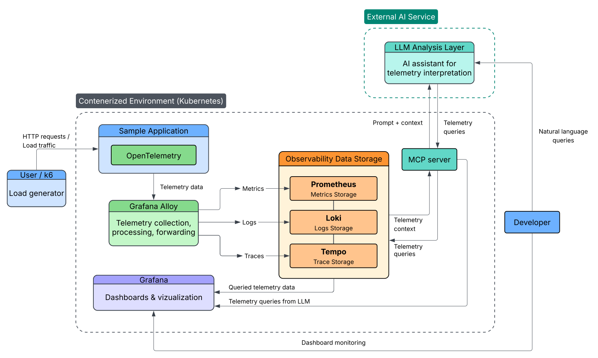

# k8s-alloy-observability
Kubernetes observability setup using Grafana Alloy as an OpenTelemetry Collector to gather, process, and export telemetry data from cluster workloads.

# Wstęp i Cele Projektu
Ten projekt demonstruje nowoczesne podejście do obserwacyjności w środowisku Kubernetes, wykorzystując Grafana Alloy jako centralny procesor danych oraz LLM (Large Language Models) do inteligentnej analizy i wizualizacji telemetrii. Celem systemu jest skrócenie czasu od wystąpienia incydentu do jego wizualizacji poprzez automatyzację zapytań analitycznych. System pozwala deweloperowi na zadawanie pytań w języku naturalnym, które są tłumaczone na techniczne zapytania i natychmiastowo wyświetlane w Grafanie.

# Architektura Systemu (High-Level)
Poniższy schemat przedstawia architektóre systemu:

<!--  -->

Opis Komponentów Architektury:
1. Traffic Generation (User / k6): Symuluje ruch użytkowników oraz obciążenie HTTP, generując realne dane procesowe w aplikacji.
2. Sample Application: Konteneryzowana aplikacja w K8s z zainstrumentowanym OpenTelemetry SDK, wysyłająca surowe dane telemetryczne.
3. Grafana Alloy: Odbiera dane (OTLP).
4. Przetwarza je i przekazuje do odpowiednich baz danych.
6. Observability Data Storage:
- Prometheus: Składowanie metryk wydajnościowych.
- Loki: Agregacja i przechowywanie logów aplikacji.
- Tempo: Przechowywanie śladów (traces) do analizy rozproszonej.
7. AI Analysis Layer:
- Deweloper wysyła zapytanie w języku naturalnym (np. "Pokaż mi błędy 500 z ostatniej godziny i powiązane z nimi ślady").
- MCP Server dostarcza kontekst telemetryczny do LLM.
- LLM generuje gotowe zapytania (PromQL/LogQL).
8. Grafana Visualization: wygenerowane przez AI zapytania są uruchamiane, tworząc dynamiczne dashboardy i wizualizacje.
