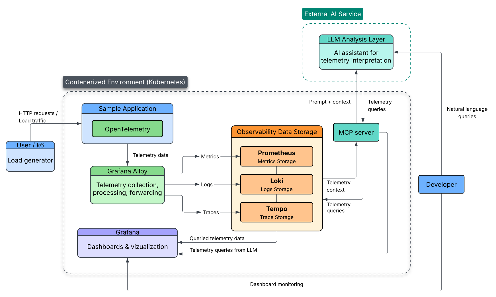

# k8s-alloy-observability

Lokalne środowisko obserwacyjności dla Kubernetes/Minikube. Repozytorium uruchamia aplikację przykładową Bookinfo, generator ruchu k6 oraz stos Grafana + Loki + Prometheus + Grafana Alloy. Dodatkowo zawiera serwer MCP dla Cursora, który pozwala agentowi LLM odpytywać Grafanę, odkrywać etykiety i metryki oraz tworzyć dashboardy bez ręcznego składania JSON-a paneli.

**Szybki start:** [`SETUP.md`](SETUP.md) (`make deploy` -> `make port-forward-grafana` -> `make enable-mcp-grafana`).

## Cel projektu

Projekt pokazuje, jak połączyć lokalny klaster Kubernetes z praktycznym workflow obserwacyjności:

- uruchomić kontrolowany ruch HTTP do aplikacji Bookinfo,
- zbierać logi aplikacji i joba k6 przez Grafana Alloy,
- przechowywać logi w Loki i metryki w Prometheusie,
- provisionować Grafanę z gotowymi datasource'ami i dashboardami,
- udostępnić dane telemetryczne agentowi LLM w Cursorze przez Model Context Protocol.

Obecna implementacja koncentruje się na logach i metrykach. W repozytorium nie ma skonfigurowanego Tempo ani pipeline'u trace'ów, a aplikacja Bookinfo używa gotowych obrazów z przykładów Istio, bez dodatkowej instrumentacji OpenTelemetry SDK w kodzie aplikacji.

## Architektura



Rozwiązanie działa w dwóch namespace'ach:

- `apps` - aplikacja Bookinfo (`productpage`, `details`, `ratings`, `reviews`) oraz jednorazowy `Job` k6 generujący ruch do `productpage`.
- `olly` - Loki, Prometheus, Grafana i Grafana Alloy instalowane przez Helm.

Przepływ danych:

1. k6 wykonuje przez około 30 sekund żądania HTTP do `productpage.apps.svc.cluster.local:9080/productpage?product=1`.
2. Bookinfo generuje logi kontenerów w namespace `apps`.
3. Alloy korzysta z `discovery.kubernetes` dla podów, filtruje workloady Bookinfo i job k6, dodaje etykiety `app`, `namespace` i `pod`, a następnie wysyła logi do Loki przez `http://loki.olly:3100/loki/api/v1/push`.
4. Prometheus zbiera metryki klastra i workloadów z instalacji chartu `prometheus-community/prometheus`.
5. Grafana jest provisionowana z datasource'ami `Loki` (`uid: loki`) i `Prometheus` (`uid: prometheus`) oraz folderem dashboardów `Observability`.
6. Serwer MCP `grafana-query` łączy się z lokalną Grafaną przez `http://127.0.0.1:3000`, gdy działa `make port-forward-grafana`.
7. Cursor/LLM wywołuje narzędzia MCP, aby odczytać kontekst projektu, wykonać LogQL/PromQL i opcjonalnie utworzyć dashboard w Grafanie.

## Główne komponenty

### Aplikacja i ruch testowy

Manifesty w [`kubernetes/deployments.yml`](kubernetes/deployments.yml) i [`kubernetes/services.yml`](kubernetes/services.yml) wdrażają cztery serwisy Bookinfo:

- `productpage`
- `details`
- `ratings`
- `reviews`

Generator ruchu jest zdefiniowany w [`kubernetes/k6-config.yml`](kubernetes/k6-config.yml) i [`kubernetes/k6-job.yml`](kubernetes/k6-job.yml). Domyślnie uruchamia 5 wirtualnych użytkowników przez 30 sekund. Po zakończeniu pod k6 ma status `Completed`; to oczekiwane zachowanie. Aby wygenerować świeże logi, użyj:

```powershell
make restart-k6
```

### Alloy i Loki

Konfiguracja Alloy znajduje się w [`kubernetes/alloy-config.yml`](kubernetes/alloy-config.yml). Zawiera dwa pipeline'y Loki:

- `loki.source.kubernetes.bookinfo` - logi podów z etykietami `app=productpage|details|ratings|reviews`,
- `loki.source.kubernetes.k6` - logi joba `k6-load-generator`.

Alloy wykonuje `stage.cri`, tworzy pomocnicze liczniki linii logów (`bookinfo_log_lines_total`, `k6_log_lines_total`) i wysyła strumienie do Loki. Loki jest instalowany z chartu `grafana/loki-stack`, bez Promtaila, Fluent Bita i wbudowanej Grafany, ponieważ zbieraniem logów zajmuje się Alloy, a Grafana jest osobnym releasem.

### Prometheus

Prometheus jest instalowany jako release `prometheus` z chartu `prometheus-community/prometheus`. Grafana używa go jako datasource'a `Prometheus`. Serwer MCP potrafi odczytywać nazwy metryk, wartości etykiet i wykonywać zapytania PromQL, np. `up`, `rate(container_cpu_usage_seconds_total[5m])` albo `kube_pod_status_phase`.

### Grafana

Grafana jest instalowana z chartu `grafana/grafana` i wartościami z [`kubernetes/grafana-values.yml`](kubernetes/grafana-values.yml). Konfiguracja ustawia:

- service typu `NodePort` z portem `30300`,
- datasource Loki jako domyślny,
- datasource Prometheus,
- folder dashboardów `Observability`,
- dashboard `Bookinfo Logs (Loki)`,
- dashboard `Logs Count (Loki)`.

Najczęstszy lokalny dostęp do Grafany:

```powershell
make port-forward-grafana
```

Po uruchomieniu port-forward Grafana jest dostępna pod `http://127.0.0.1:3000`. Login to `admin`, a hasło można odczytać komendą:

```powershell
make grafana-password
```

## Grafana Query MCP (`mcp-grafana/`)

Serwer [Model Context Protocol](https://modelcontextprotocol.io/) `grafana-query` łączy Cursor IDE lub Cursor CLI `agent` z lokalną Grafaną. Nie uruchamia własnego modelu AI. Jest warstwą narzędziową: udostępnia LLM-owi dane z Grafany i operacje tworzenia dashboardów.

Jak działa:

1. Cursor uruchamia proces opisany w `.cursor/mcp.json`.
2. Proces startuje [`mcp-grafana/scripts/run-mcp.mjs`](mcp-grafana/scripts/run-mcp.mjs).
3. Wrapper ładuje `GRAFANA_PASSWORD` ze zmiennej środowiskowej albo z `~/.cursor/grafana-query.env`.
4. Serwer TypeScript [`mcp-grafana/src/index.ts`](mcp-grafana/src/index.ts) działa po stdio jako transport MCP.
5. [`mcp-grafana/src/grafana-client.ts`](mcp-grafana/src/grafana-client.ts) wykonuje żądania HTTP do Grafany: health check, datasource'y, proxy Loki/Prometheus, zapytania `/api/ds/query`, wyszukiwanie i tworzenie dashboardów.
6. [`mcp-grafana/src/dashboard-builder.ts`](mcp-grafana/src/dashboard-builder.ts) buduje dashboardy Grafany z panelami `logs`, `timeseries` i `stat`.

Logika `suggest_grafana_queries` i `create_dashboard_from_prompt` jest heurystyczna: bazuje na słowach kluczowych w prompcie, znanych jobach Loki i etykietach/metadanych odczytanych z Grafany, dzięki temu agent nie musi wczytywać wszystkich logów generowanych przez aplikacje. Tłumaczenie intencji użytkownika na użycie narzędzi wykonuje LLM w Cursorze.

### Struktura katalogu MCP

```text
mcp-grafana/
├── package.json
├── README.md
├── src/
│   ├── index.ts
│   ├── grafana-client.ts
│   └── dashboard-builder.ts
└── scripts/
    ├── run-mcp.mjs
    └── setup-global-mcp.ps1
```

### Narzędzia MCP

| Narzędzie | Opis |
|-----------|------|
| `grafana_health` | Sprawdza połączenie z Grafaną |
| `get_observability_context` | Zwraca kontekst projektu: namespace'y, joby Loki, aplikacje Bookinfo i przykładowe zapytania |
| `list_datasources` | Listuje datasource'y Grafany |
| `loki_label_names` / `loki_label_values` | Odczytuje etykiety Loki |
| `run_loki_query` | Wykonuje LogQL przez Grafanę |
| `prometheus_metric_names` / `prometheus_label_values` | Odczytuje metadane Prometheusa |
| `run_prometheus_query` | Wykonuje PromQL przez Grafanę |
| `search_dashboards` / `get_dashboard_queries` | Wyszukuje dashboardy i wyciąga zapytania z paneli |
| `suggest_grafana_queries` | Sugeruje LogQL/PromQL na podstawie promptu i dostępnych danych |
| `create_dashboard` | Tworzy dashboard z jawnie podanych paneli |
| `create_dashboard_from_prompt` | Sugeruje i waliduje zapytania, tworzy dashboard i zwraca URL |

## Najważniejsze komendy

```powershell
make deploy                 # wdrożenie aplikacji, Loki, Prometheusa, Grafany, Alloy, k6 i MCP
make port-forward-grafana   # Grafana na http://127.0.0.1:3000
make enable-mcp-grafana     # zatwierdzenie serwera MCP w Cursor CLI
make verify-mcp-grafana     # weryfikacja port-forward, hasła i konfiguracji MCP
make verify-loki            # sprawdzenie wartości labela job w Loki
make restart-k6             # ponowne wygenerowanie ruchu i logów
make fix-dashboard-data     # restart Alloy + k6 + reprovision dashboardów Grafany
make status                 # status zasobów w namespace'ach apps i olly
make delete                 # usunięcie całego stosu
```

Pełna instrukcja uruchomienia jest w [`SETUP.md`](SETUP.md), a przykładowe prompty dla agenta w [`DEMO.md`](DEMO.md).
