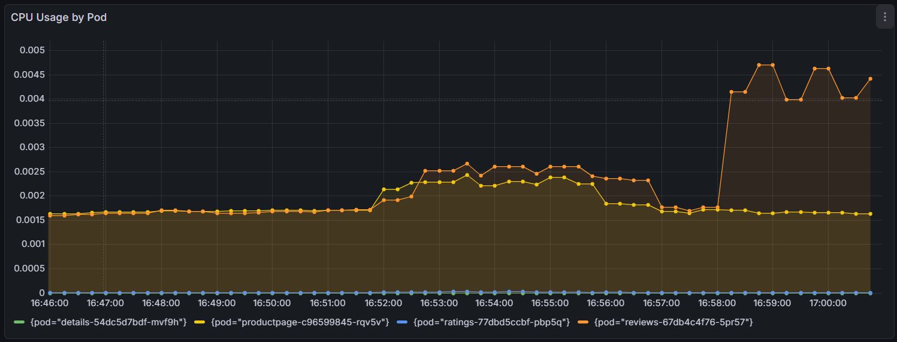
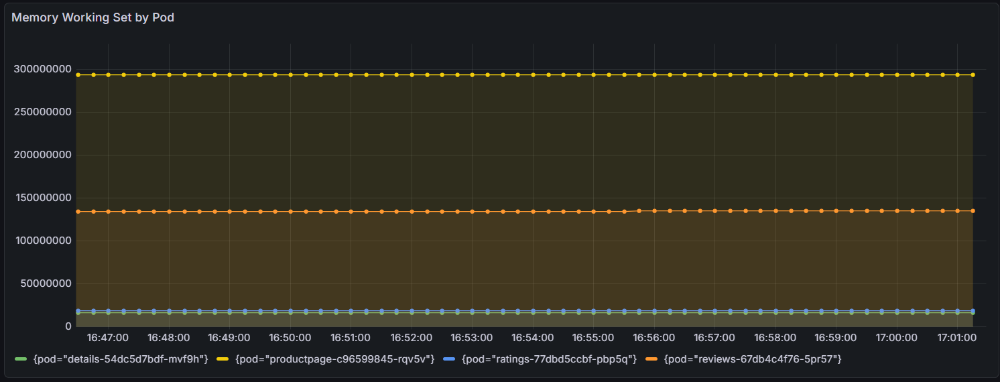
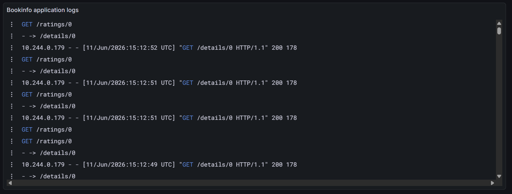

# Experiments to test mcp server
## Dashboard creation
### ***Prompt***: "Create a Prometheus dashboard for CPU and memory usage of Bookinfo pods in the apps namespace. Return the dashboard URL."

***Response:***

agent -p --trust --force --approve-mcps "Create a Prometheus dashboard for CPU and memory usage of Bookinfo pods in the apps namespace. Return the dashboard URL"
Created a Prometheus dashboard for Bookinfo pod CPU and memory in the `apps` namespace.

**Dashboard URL:** http://127.0.0.1:3000/d/bookinfo-pod-cpu-memory-apps/bookinfo-pod-cpu-and-memory-apps

It includes two panels:

1. **CPU Usage by Pod** — `rate(container_cpu_usage_seconds_total{...}[5m])` summed per pod
2. **Memory Working Set by Pod** — `container_memory_working_set_bytes` summed per pod

Both panels filter to Bookinfo services (`productpage`, `details`, `ratings`, `reviews`) in the `apps` namespace. Queries were validated against live Prometheus data for all four pods.

***Dashboards***




### ***Prompt*** Create a dashboard from prompt: "Bookinfo and k6 log volume over time with count by app". Return the dashboard URL

***Response***

agent -p --trust --force --approve-mcps "Create a dashboard from prompt: Bookinfo"
The **Bookinfo** dashboard is live in Grafana.

**URL:** [http://127.0.0.1:3000/d/bookinfo-9mpyeg/bookinfo](http://127.0.0.1:3000/d/bookinfo-9mpyeg/bookinfo)

### What's on it

| Panel | Query |
|-------|--------|
| **Bookinfo application logs** | `{job="loki.source.kubernetes.bookinfo"}` |

The query was validated against your Loki datasource and matches Alloy’s Bookinfo log collection (`productpage`, `details`, `ratings`, `reviews` in the `apps` namespace).

### Tips

- Use **Last 15 minutes** if you’ve just run load tests — k6 logs use `job="loki.source.kubernetes.k6"`.
- For errors only: `{job="loki.source.kubernetes.bookinfo"} |~ "(?i)error|exception|fail"`

I can extend this with per-app panels, error rates, or k6 load-test panels if you want.
make: *** No rule to make target 'and'.  Stop.

***Dashboards***


### Prompt: List available Prometheus metric names and show label values for namespace and pod in Prometheus

***Response***
agent -p --trust --force --approve-mcps "List available Prometheus metric names and show label values for namespace and pod in Prometheus"
Here is what Prometheus currently exposes through Grafana (datasource uid: `prometheus`).

## Prometheus metrics

**Total available:** 1,634 metric names (showing first 100 below)

| Category | Examples |
|----------|----------|
| **API server** | `apiserver_audit_event_total`, `apiserver_request_duration_seconds_bucket`, `apiserver_current_inflight_requests` |
| **Flow control** | `apiserver_flowcontrol_current_executing_requests`, `apiserver_flowcontrol_request_wait_duration_seconds_*` |
| **Admission / auth** | `apiserver_admission_controller_admission_duration_seconds_*`, `apiserver_authorization_decisions_total` |
| **Aggregation** | `aggregator_discovery_aggregation_count_total`, `aggregator_unavailable_apiservice` |
| **API extensions** | `apiextensions_apiserver_validation_ratcheting_seconds_*`, `apiextensions_openapi_v2_regeneration_count` |

Full first page (alphabetical):

```
aggregator_discovery_aggregation_count_total
aggregator_unavailable_apiservice
aggregator_unavailable_apiservice_total
apiextensions_apiserver_validation_ratcheting_seconds_bucket
apiextensions_apiserver_validation_ratcheting_seconds_count
apiextensions_apiserver_validation_ratcheting_seconds_sum
apiextensions_openapi_v2_regeneration_count
apiextensions_openapi_v3_regeneration_count
apiserver_admission_controller_admission_duration_seconds_bucket
apiserver_admission_controller_admission_duration_seconds_count
apiserver_admission_controller_admission_duration_seconds_sum
apiserver_admission_step_admission_duration_seconds_bucket
apiserver_admission_step_admission_duration_seconds_count
apiserver_admission_step_admission_duration_seconds_sum
apiserver_admission_step_admission_duration_seconds_summary
apiserver_admission_step_admission_duration_seconds_summary_count
apiserver_admission_step_admission_duration_seconds_summary_sum
apiserver_audit_event_total
apiserver_audit_requests_rejected_total
apiserver_authorization_decisions_total
apiserver_cache_list_fetched_objects_total
apiserver_cache_list_returned_objects_total
apiserver_cache_list_total
apiserver_cel_compilation_duration_seconds_bucket
apiserver_cel_compilation_duration_seconds_count
apiserver_cel_compilation_duration_seconds_sum
apiserver_cel_evaluation_duration_seconds_bucket
apiserver_cel_evaluation_duration_seconds_count
apiserver_cel_evaluation_duration_seconds_sum
apiserver_client_certificate_expiration_seconds_bucket
apiserver_client_certificate_expiration_seconds_count
apiserver_client_certificate_expiration_seconds_sum
apiserver_current_inflight_requests
apiserver_current_inqueue_requests
apiserver_delegated_authn_request_duration_seconds_bucket
apiserver_delegated_authn_request_duration_seconds_count
apiserver_delegated_authn_request_duration_seconds_sum
apiserver_delegated_authn_request_total
apiserver_delegated_authz_request_duration_seconds_bucket
apiserver_delegated_authz_request_duration_seconds_count
apiserver_delegated_authz_request_duration_seconds_sum
apiserver_delegated_authz_request_total
apiserver_envelope_encryption_dek_cache_fill_percent
apiserver_flowcontrol_current_executing_requests
apiserver_flowcontrol_current_executing_seats
apiserver_flowcontrol_current_inqueue_requests
apiserver_flowcontrol_current_inqueue_seats
apiserver_flowcontrol_current_limit_seats
apiserver_flowcontrol_current_r
apiserver_flowcontrol_demand_seats_average
apiserver_flowcontrol_demand_seats_bucket
apiserver_flowcontrol_demand_seats_count
apiserver_flowcontrol_demand_seats_high_watermark
apiserver_flowcontrol_demand_seats_smoothed
apiserver_flowcontrol_demand_seats_stdev
apiserver_flowcontrol_demand_seats_sum
apiserver_flowcontrol_dispatch_r
apiserver_flowcontrol_dispatched_requests_total
apiserver_flowcontrol_latest_s
apiserver_flowcontrol_lower_limit_seats
apiserver_flowcontrol_next_discounted_s_bounds
apiserver_flowcontrol_next_s_bounds
apiserver_flowcontrol_nominal_limit_seats
apiserver_flowcontrol_priority_level_request_utilization_bucket
apiserver_flowcontrol_priority_level_request_utilization_count
apiserver_flowcontrol_priority_level_request_utilization_sum
apiserver_flowcontrol_priority_level_seat_utilization_bucket
apiserver_flowcontrol_priority_level_seat_utilization_count
apiserver_flowcontrol_priority_level_seat_utilization_sum
apiserver_flowcontrol_read_vs_write_current_requests_bucket
apiserver_flowcontrol_read_vs_write_current_requests_count
apiserver_flowcontrol_read_vs_write_current_requests_sum
apiserver_flowcontrol_request_dispatch_no_accommodation_total
apiserver_flowcontrol_request_execution_seconds_bucket
apiserver_flowcontrol_request_execution_seconds_count
apiserver_flowcontrol_request_execution_seconds_sum
apiserver_flowcontrol_request_queue_length_after_enqueue_bucket
apiserver_flowcontrol_request_queue_length_after_enqueue_count
apiserver_flowcontrol_request_queue_length_after_enqueue_sum
apiserver_flowcontrol_request_wait_duration_seconds_bucket
apiserver_flowcontrol_request_wait_duration_seconds_count
apiserver_flowcontrol_request_wait_duration_seconds_sum
apiserver_flowcontrol_seat_fair_frac
apiserver_flowcontrol_target_seats
apiserver_flowcontrol_upper_limit_seats
apiserver_flowcontrol_watch_count_samples_bucket
apiserver_flowcontrol_watch_count_samples_count
apiserver_flowcontrol_watch_count_samples_sum
apiserver_flowcontrol_work_estimated_seats_bucket
apiserver_flowcontrol_work_estimated_seats_count
apiserver_flowcontrol_work_estimated_seats_sum
apiserver_init_events_total
apiserver_kube_aggregator_x509_insecure_sha1_total
apiserver_kube_aggregator_x509_missing_san_total
apiserver_longrunning_requests
apiserver_nodeport_repair_reconcile_errors_total
apiserver_request_body_size_bytes_bucket
apiserver_request_body_size_bytes_count
apiserver_request_body_size_bytes_sum
apiserver_request_duration_seconds_bucket
```

Useful PromQL examples for this project: `up`, `rate(container_cpu_usage_seconds_total[5m])`, `kube_pod_status_phase`.

---

## Label values

### `namespace` (8 values)

| Namespace | Likely role |
|-----------|-------------|
| `apps` | Bookinfo workloads |
| `default` | Default namespace |
| `kube-node-lease` | Node heartbeats |
| `kube-public` | Cluster public info |
| `kube-system` | Core Kubernetes components |
| `kubernetes-dashboard` | Dashboard UI |
| `observability` | Grafana, Loki, Prometheus, Alloy |
| `olly` | Observability stack (alternate) |

### `pod` (37 values)

**Bookinfo (`apps`):**
- `details-54dc5d7bdf-mvf9h`
- `productpage-c96599845-rqv5v`
- `ratings-77dbd5ccbf-pbp5q`
- `reviews-67db4c4f76-5pr57`

**Load testing:**
- `k6-load-generator-*` (8 pods)

**Observability:**
- `alloy-*` (3 pods)

 Writing web request
    Writing request stream... (Number of bytes written: 10663376)

- `prometheus-kube-state-metrics-*`
- `prometheus-prometheus-node-exporter-*`
- `prometheus-prometheus-pushgateway-*` (2 pods)

**Kubernetes system:**
- `coredns-*`, `etcd-minikube`, `kube-apiserver-minikube`, `kube-controller-manager-minikube`, `kube-proxy-*`, `kube-scheduler-minikube`, `metrics-server-*`, `storage-provisioner`

**Other:**
- `kubernetes-dashboard-*`, `dashboard-metrics-scraper-*`

---

Example queries filtering by these labels:

```promql
up{namespace="apps"}
kube_pod_status_phase{namespace="observability", pod=~"grafana-.*"}
rate(container_cpu_usage_seconds_total{namespace="apps", pod="productpage-c96599845-rqv5v"}[5m])
```

If you want, I can list more metric names (e.g. next 100), or filter metrics/labels to a specific namespace like `apps` or `observability`.

